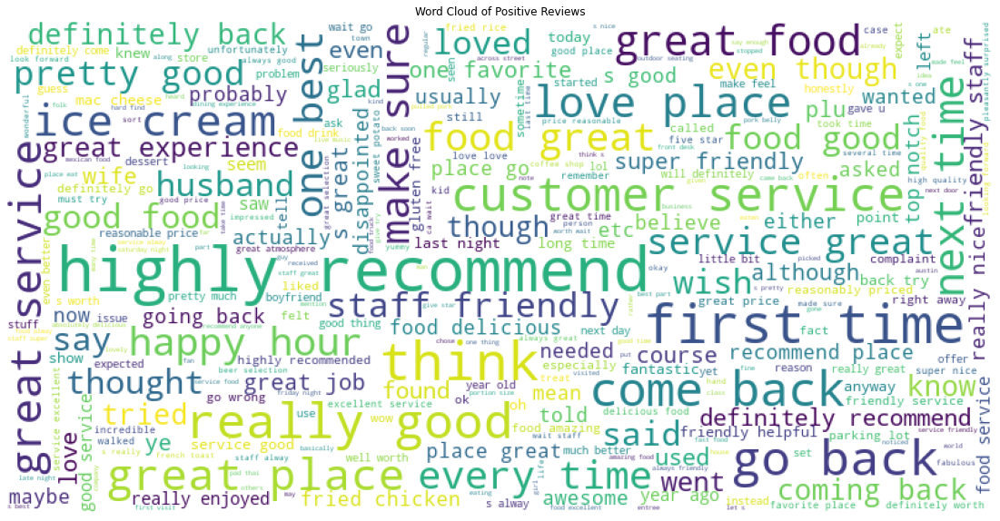
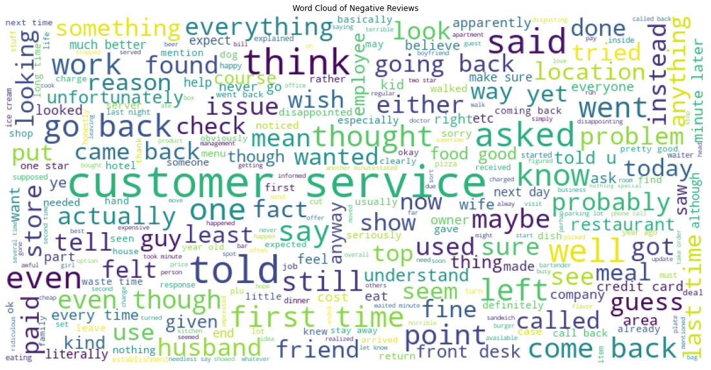

# Sentiment Analysis on Yelp's Dataset

> Author: Roberto Sanchez, Talent Path: D1 Group

## Docker Deployment:

Deployment of this application can be found [here](http://54.241.130.105:5000/) hosted on AWS

Running it locally: 

```bash
docker pull rsanchez2892/sentiment_analysis_app
```


## Overview

The scope of this capstone is centered around the data processing, exploratory data analysis, and training of a model to predict sentiment on user reviews.


### Business Goals

Create a model to be able to be used in generating sentiment on reviews or comments found in external / internal websites to give insights on how people feel about certain topics.

This could give the company insights not easily available on sites where ratings are required or for internal use to determine sentiment on blogs or comments.


### Business Applications

By utilizing this model, the business can use it for the following purposes:

**External:**

- Monitoring Brand and Reputation online
- Product Research

**Internal:**

- Customer Support
- Customer Feedback
- Employee Satisfaction

Currently method to achieving this is by using outside resources which come at a cost and increases risk for leaking sensitive data to the public. This product will bypass these outside resources and give the company the ability to do it in house.


## Model Deployment

Link: [Review Analyzer](https://secure-bastion-71984.herokuapp.com/)

After running multiple models and comparing accuracy, I found that the LinearSVC model is a viable candidate to be used in production for analyzing reviews of services or food. 

### Classification Report / Confusion Matrix:


## Technology Stack

I have been using these technologies for this project:

* [Jupyter Notebook](https://jupyter.org/) - **Version 6.3.0**
  * Used for most of the data processing, EDA, and model training.
* [Python](https://www.python.org/) - **Version 3.8.8**
  * The main language this project will be done in.
* [Scikit-learn](https://scikit-learn.org/stable/) - **Version 0.24**
  * Utilizing metrics reports and certain models.
* [Postgres](https://www.postgresql.org/) - **Version 13**
  * Main database application used to store this data.
* [Flask](https://flask.palletsprojects.com/en/2.0.x/) - **Version 1.1.2**
  * Main backend technology to host a usable version of this project to the public.
* [GitHub](https://github.com/)
  * Versioning control and online documentation
* [Heroku](https://dashboard.heroku.com/apps)
  * Online cloud platform to host this application for public use


## Data Processing

This capstone uses the Yelp dataset found on [Kaggle](https://www.kaggle.com/yelp-dataset/yelp-dataset/) which comprises of multiple files:

* Business Data
* Check-in Data
* Review Data
* Tips Data
* User Data

### Stage 1 - Read in From JSON files into Postgres

**Overview**

* Read in JSON files
* General observations on the features found in each file
* Modifying feature names to meet Postgres naming convention
* Normalized the data to prepare for import to Postgres
* Saved copies of each table as CSV file for backup incase Database goes down
* Exported data into Postgres

As stated above, Kaggle provided several JSON files with a large amount of data that needed to be stored in a location for easy access and provide a quick way to query data on the fly. As the files were read in Jupyter notebook a general observation was made to the feature names and amount each file contained to see what data I was dealing with along with the types associated with them. The business data contained a strange number of attributes that had to be broken up into separate data frames to be normalized for Postgres. 

### Stage 2 -  Pre-Processing Data

**Overview**

* Read in data from Postgres
* IDing Null Values
* Removing Sparse features
* Saved data frame as a pickle to be used in model training

This stage I performed elementary data analysis where I analyze any null values, see the distribution of my ratings and review lengths.

### Stage 3 - Cleaning Up Data

**Overview**

* Replace contractions with expanded versions
* Lemmatized text
* Removed special characters, dates, emails, and URLs
* Removed stop words
* Remove non-english text
* Normalized text

## Exploratory Data Analysis

### Analyzing Null Values in Dataset

Below is a visualization of the data provided by Kaggle showing which features have "NaN " values. Its is clear that the review ratings (review_stars) and reviews (text) are fully populated. Some of the business attributes are sparse but have enough values to be useful for other things. Note several other features were dropped in the Data Processing since they did not provide any insights for the scope of this project.


### Looking Closer at the Ratings (review_stars)

This is a sample of 2 million rows from the original 8 million in the dataset. This distribution of ratings has a left skew on it where most of the reviews are 4 to 5 stars.


I simplified the ratings to better categorize the sentiment of the review by grouping 1 and 2 star reviews as 'negative', 3 star review as 'neutral', and 4 and 5 star reviews as 'positive'.


### Looking Closer at the Reviews (text)

To analyze the text, I've calculated the length of each review in the sample and plotted a distribution graph showing them the number of characters of each review. The statistics were that the median review was approx. 606 characters with a range of 0 through 5000 characters.


A closer inspection on the range 0 - 2000 we can see that most of  the reviews are around this general area. 


In order to produce a viable word cloud, I've had to process all of the text in the sample to remove special characters and stop words from NLTK to produce a viable string to be used in word cloud. Below is a visualization of all of the key words found in the positive reviews.



As expected, words like "perfect", "great", "good", "great place", and "highly recommend" came out on top.



On the negative word cloud, words like "bad", "customer service", "never", "horrible",  and "awful" are appearing on the word cloud. 

## Model Training

### Model Selection


These four models were chosen to be trained with this data. Each of these models had a pipeline created with TfidfVectorizer.

### Model Training

* Run a StratifiedKFold with a 5 fold split and analyze the average scores and classification reports
  * Get an average accuracy of the model for comparison
* Create a single model to generate a confusion matrix
* Test out model on a handful of examples

Below is the average metrics after running 5 fold cross validation on LinearSVC


## Testing Model

After the model was trained, I fed it some reviews I found online to test out whether or not the model can properly detect the right sentiment. The following reviews are ordered as "Negative", "Neutral", and "Positive":

```python
new_test_data = [
    "This was the worst place I've ever eaten at. The staff was rude and did not take my order until after i pulled out my wallet.",
    "The food was alright, nothing special about this place. I would recommend going elsewhere.",
    "I had a pleasent time with kimberly at the granny shack. The food was amazing and very family friendly.",
]
res = model.prediction(new_test_data)
```

Below is the results of the prediction, notice that the neutral review has been labeled as negative. This makes sense since the model has a poor recall for neutral reviews as shown in the classification report.


## End Notes

There are some improvements to be made such as the follow:

* **Balancing the data**
  * This can be seen in the confusion matrix for the candidate models and other models created that the predictions come out more positive than negative or neutral.
  * While having poor scores in the neutral category, the most important features are found in the negative and positive predictions for business applications.
* **Hyper-parametrization improvement**
  * Logistic Regression and Multinomial NB models produced models within a reasonable time frame while returning reasonable scores. Random Forrest Classifier and SVM took a **significant** amount of time to produce just one iteration. In order to produce results from this model StratifiedKFold was not used in these two models. Changing SVM to LinearSVC improved performance dramatically and replaced the SVM model and outperformed Logistic Regression which was the original candidate model.

