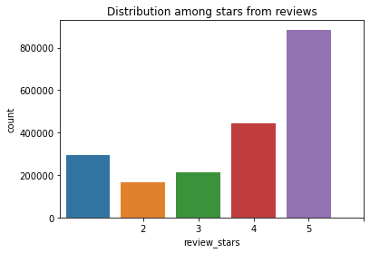

# Sentiment Analysis on Yelp's Dataset

> Author: Roberto Sanchez, Talent Path: D1 Group

## Table of Contents

[TOC]

## Overview

This capstone project is centered around the data processing, elementary data analysis, and training of a model to predict user reviews sentiment.

### Business Goals

Create a model to be able to be used in generating sentiments on reviews or comments found in external websites to give insights on what people are talking about outside of Yelp.

This could give the company insights not easily available on sites where ratings are required or for internal use to determine sentiment on blogs or comments.

## Model Deployment

> Show demo of model

### Technology Stack

I'll be using these technologies for this project:

* [Jupyter Notebook](https://jupyter.org/) - **Version 6.3.0**
  * Used for most of the data processing, EDA, and model training.
* [Python](https://www.python.org/) - **Version 3.8.8**
  * The main language this project will be done in.
* [Tensorflow](https://www.tensorflow.org/) - **Version 2.5**
  * Using Keras to create and train our model.
* [Nvidia CUDA  Toolkit](https://developer.nvidia.com/cuda-toolkit) - **Version 11.2**
  * To enable TensorFlow to utilize the GPU to speed up training.
* [Scikit-learn](https://scikit-learn.org/stable/) - **Version 0.24**
  * Utilizing metrics reports
* [Postgres](https://www.postgresql.org/) - **Version 13**
  * Main database application used to store this data.
* [Flask](https://flask.palletsprojects.com/en/2.0.x/) - **Version 1.1.2**
  * Main backend technology to host a usable version of this project to the public.

## Data Processing

This capstone uses the Yelp dataset found on [Kaggle](https://www.kaggle.com/yelp-dataset/yelp-dataset/) which comprises of multiple files:

* Business Data
* Check-in Data
* Review Data
* Tips Data
* User Data

The scope of this capstone only requires data from the Review Data JSON file to analyze. From this data I import it using 

## Elementary Data Analysis

Aggregating all the data I looked at the null values found in the dataset:

Looking at this I have reviews for every business 

Analyzing the review data showed not that much to consider apart from that there was an imbalance in the data.

Below is a graph of the distribution of the ratings between 1 to 5:

## Model Training

## Testing Model

## End Notes

